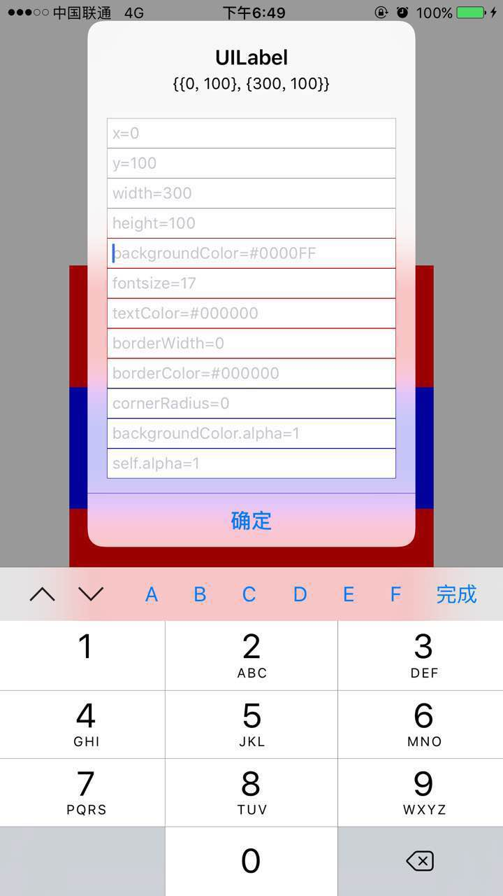

## 1.想要解决的问题?
作为一名iOS开发者,以下的场景你一定不会陌生:和公司里的UI设计一起调试界面的时候,UI问你你这个Button的宽度是多少,然后你一顿翻代码,最终定位到该button设置frame的位置,然后说这个Button的宽度是50,UI说有点多了,改成48看看吧,于是你改为48,重新运行代码,安装好之后,一顿点击,最终在APP中找到该button的位置,这时候,UI含情脉脉的看着你,好像还有点宽,改成45看看,于是上述场景继续……
so,问题来了？一遍又一遍的运行,查看效果,这样出力不讨好的，浪费时间而且极端低效的操作有没有方法避免呢？有没有办法直接修改成最终需要的效果,UI满意之后,再去修改代码呢?方法当然有,那就是该框架所要做的.目的就是在不需要重新安装APP的情况下,直接在APP中修改控件的各项属性,及时查看最新效果,达到自己满意的效果之后,最终再去修改代码。
## 2.为什么选择使用这个框架？
1. 集成和使用方法简单
2. 方便及时查看和修改UIView的各项常见属性
3. 随时可以取消使用，上线模式自动不可用，不必害怕上线忘了把enabeld属性置为NO,省时省力，不费心
4. 更进一步的，如果有可能，以后修改UI界面的任务可以交给UI自己做了，给他们装一个包，让他们自己点，修改到满意了，再让她来找你调代码，避免时间浪费
## 3.集成方法
该框架支持手动集成和cocoapods集成
1. 如果你想通过cocoapods集成,只需要把该框架加入你的Podfile文件即可,pod 'UIHelper'
2. 也可以把项目下载下来,把里面的UIHelper文件夹拖到项目中即可
## 4.使用方法
1. 在需要使用该框架的地方
```
#import <UIHelper/UIHelper.h>
```
2. 在项目的AppDelegate.m项目启动方法里面启用UIHelper
```
- (BOOL)application:(UIApplication *)application didFinishLaunchingWithOptions:(NSDictionary *)launchOptions {
    // Override point for customization after application launch.
    //启用UIHelper,不用的时候在此设置enabled=NO即可
    [UIHelper sharedHelper].enabled = YES;

    //other code

    return YES;
}
```
3. 对你想要添加UIHelper服务的View,比如_testView
```
//添加UIHelper服务,YES代表包括其子视图,NO仅仅代表自己
[_testView addUIHelperRecursive:YES]
```
## 5.效果示例
1. 双击已经添加过UIHelper服务的蓝色UILabel将会弹出以下界面
2. 在想修改的属性框里面输入属性值，点击确认，查看效果
3. 效果满意，修改代码


## 6.最后

* 如果在使用过程中遇到BUG，希望你能Issues我，谢谢（或者尝试下载最新的框架代码看看BUG修复没有）
* 如果在使用过程中发现功能不够用，希望你能Issues我，我非常想为这个框架增加更多好用的功能，谢谢
* 该框架目前还比较简单，但是能够满足大多数基本的UI调试需求，如果你想为UIHelper输出代码，那么非常欢迎你进行Pull Requests操作
